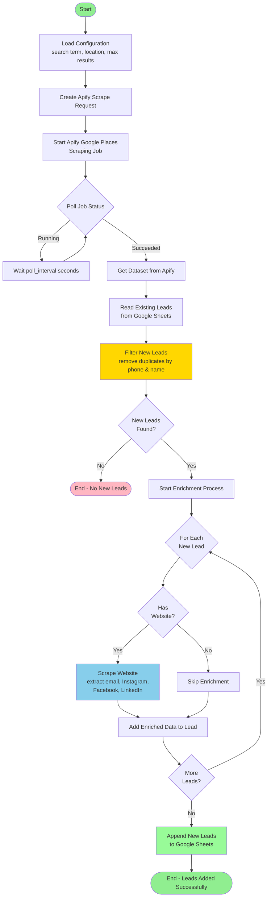

# Lead Scraper

A Python-based lead generation tool that scrapes business information from Google Places using Apify, enriches the data by scraping websites, and stores results in Google Sheets.

## Overview

This tool automates the process of finding and enriching business leads:
- Searches Google Places for businesses matching your criteria
- Extracts contact information (phone, address, website)
- Enriches leads by scraping websites for emails and social media links
- Stores unique leads in Google Sheets
- Provides utilities for data validation and deduplication

## Core Scrape Flow



## Features

### Main Scraping Mode
- Scrapes Google Places using Apify API
- Filters duplicates by phone number and business name
- Enriches leads with website data (email, social media)
- Appends unique leads to Google Sheets

### Utility Modes

#### Deduplication (`--dedupe`)
- Removes duplicate rows based on business name
- Preserves the first occurrence of each unique name

#### Link Verification (`--verify`)
- Verifies Instagram and Facebook links
- Removes invalid or broken social media links
- Checks for redirects to login pages

#### Email Extraction (`--emails`)
- Extracts all emails from the sheet
- Validates email format and domain MX records
- Displays unique validated emails

#### Import from Sheet (`--import-from-sheet`)
- Imports leads from another sheet in the same spreadsheet
- Maps columns from outreach sheet format to scraped_leads schema
- Automatically deduplicates against existing leads
- Supports columns: Business, Owner/Contact Name, phone, city, website
- Ignores place_id field (leaves empty)

## Configuration

Create a `.env` file with the following variables:

```env
APIFY_TOKEN=your_apify_token
GOOGLE_SHEET_ID=your_google_sheet_id
GOOGLE_SHEET_NAME=scraped_leads
SEARCH_TERM=plumber
LOCATION=Manchester, GB
MAX_RESULTS=120
POLL_INTERVAL=30
```

You'll also need a `credentials.json` file for Google Sheets API authentication.

## How to use

```bash
uv venv
source .venv/bin/activate
uv sync
python -m src
```

### Running Different Modes

```bash
# Normal scraping mode
python -m src

# Deduplicate existing leads
python -m src --dedupe

# Verify and clean social media links
python -m src --verify

# Extract and validate emails
python -m src --emails

# Import leads from another sheet (e.g., outreach sheet)
python -m src --import-from-sheet "whats app outreach"
```

## Architecture

### Services

- **ApifyService**: Manages Google Places scraping via Apify API
- **WebsiteScraperService**: Extracts emails and social media links from websites
- **GoogleSheetsService**: Handles reading/writing to Google Sheets
- **LinkVerificationService**: Verifies Instagram and Facebook links
- **EmailValidationService**: Validates email format and domain
- **LeadScraperWorkflow**: Orchestrates the main scraping workflow

### Data Models

- **Config**: Application configuration
- **ApifyScrapeRequest**: Apify API request parameters
- **ScrapedLead**: Lead data structure
- **ExistingLead**: Google Sheets lead structure

## Tooling

- uv
- mypy
- ruff

## Requirements

- Python 3.10+
- Apify account and API token
- Google Cloud project with Sheets API enabled
- Service account credentials for Google Sheets
